# From Code to Cloud in Minutes with OCI Functions

## Introduction

**Description**

A supplier sends an inventory CSV. Your operations team needs to know which products need restocking. In this lab, you create a Python function and connect it to an Object Storage upload event. Upload a file and the function writes two reports: products below the stock threshold and records that need correction.

**Lab Objectives**

- Explain how an application, a function, and an event work together.
- Review Python logic, using a supplied AI prompt or the tested reference implementation.
- Deploy a function and connect an Object Storage event to it.
- Upload a CSV and verify the resulting reports.

**Intended Audience**

Beginner technical learners. No previous OCI Functions experience is required.

**Estimated Time**

35-40 minutes. Optional extensions take another 10-15 minutes. 

**Prerequisites**

- Access to the prepared lab compartment and OCI Console.
- The application, network, two buckets, and logging prepared by the workshop host.
- A browser and access to OCI Cloud Shell for checking the supplied Python code.
- Optional: an AI coding assistant you already have access to. The reference code lets you complete the lab without one.

**What OCI Functions does**

OCI Functions runs your code when it is invoked, without requiring you to administer a server. An **application** groups functions that share networking and configuration. A **function** contains the code for one task. An **event rule** decides when a change in another OCI service should invoke that function.

In this lab, an upload creates an object in the incoming bucket. OCI Events matches that event and invokes your function. The function reads the CSV and writes reports to a separate output bucket.

```text
Upload inventory CSV -> Incoming bucket -> OCI Events -> Python function -> Output bucket
```

The reports are stored under a prefix named after the input file. For example, `inventory-run1.csv` produces `inventory-run1/restock-report.csv` and `inventory-run1/rejected-records.csv`.

**Resources**

- [OCI Functions overview](https://docs.oracle.com/en-us/iaas/Content/Functions/Concepts/functionsoverview.htm)
- [Creating Functions using Code Editor](https://docs.oracle.com/en-us/iaas/Content/Functions/Tasks/functionscreatingfunctions-usingcodeeditor.htm)
- [Creating an Events rule](https://docs.oracle.com/en-us/iaas/Content/Events/Task/create-events-rule.htm)
- [Function logging](https://docs.oracle.com/en-us/iaas/Content/Logging/Reference/details_for_functions.htm)

**Contact us**

For help during the workshop, contact your instructor or lab facilitator.

> **Author review edition:** The reference archive and all four CSV exercises passed in Chicago on September 17, 2026. Task 2's upload, checks, repackaging, and download were also verified in OCI Cloud Shell. A fresh learner-role dry run, beginner timing test, and green-button integration remain before publication.

## Task 1: Explore your prepared environment

**Time:** 5 minutes. **Outcome:** You can identify the resources in the upload-to-report workflow.

1. Sign in to the OCI Console and select **US Midwest (Chicago)** in the region selector.

2. Search for **Functions**, open **Applications**, and set the compartment filter to **LiveLab**.

3. Open **livelab-inventory-app**. This application provides the network and shared settings for your function. You will add a function to it in Task 3.

Open **Configuration** to find the input/output buckets, namespace, and default threshold of 10. Your namespace will be specific to your lab tenancy.

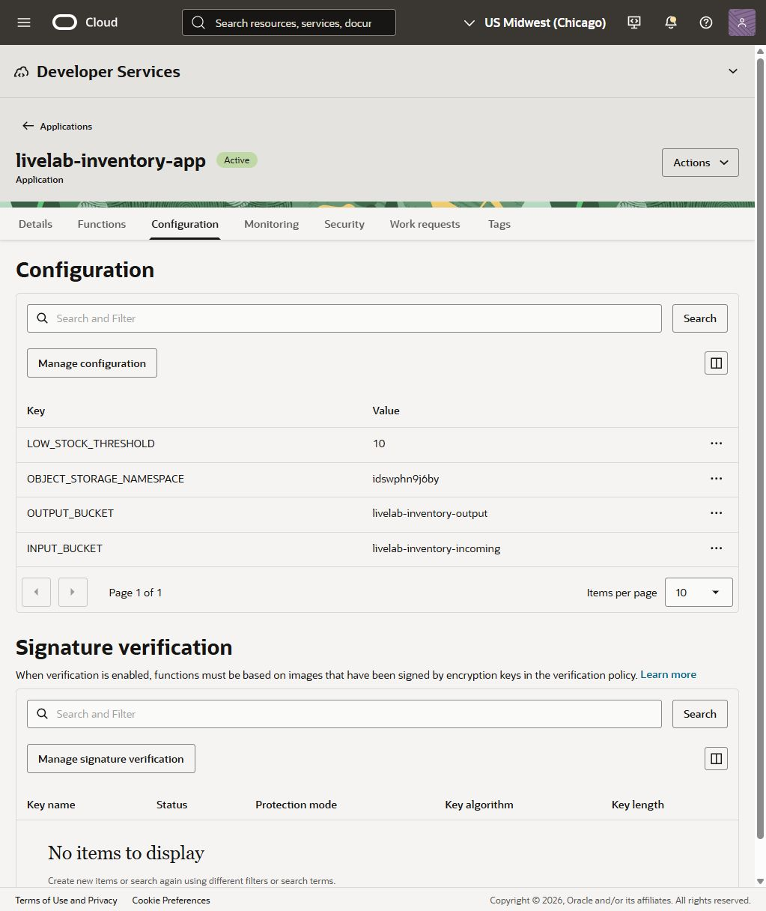

4. Search for **Buckets**, keep the **LiveLab** compartment selected, and open **livelab-inventory-incoming**.

5. On the **Details** tab, confirm that **Emit object events** is **Enabled**. This setting lets Object Storage announce new uploads to OCI Events.

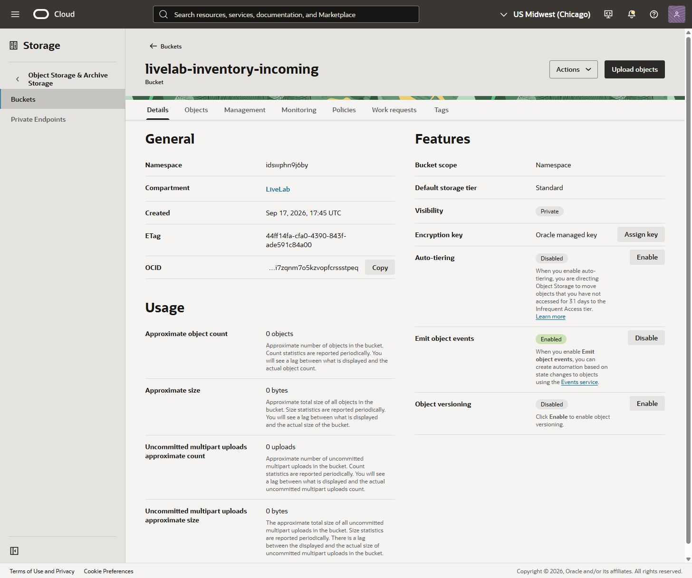

6. Return to the bucket list and locate **livelab-inventory-output**. Your reports will appear here after the function runs.

> **Checkpoint:** You found one Functions application and two buckets. The incoming bucket emits object events. The output bucket is separate, so writing a report does not trigger the same workflow again.

## Task 2: Prepare and check the Python code

**Time:** 8 minutes. **Outcome:** Your inventory-processing code passes the supplied checks.

1. Download the [source and sample data bundle](files/inventory-lab-source.zip). It includes the reference code, four input CSVs, expected reports, a checker, and the reference function ZIP. Extract the bundle before deploying; the outer source bundle is not itself a function archive.

2. Open **Cloud Shell** from the Console's **Developer tools** menu and wait for the terminal prompt. Run every command in this task in **Cloud Shell**, not a terminal on your own computer. In the Cloud Shell panel, select **Menu > Upload**, select `inventory-lab-source.zip`, and select **Upload**. Wait for **Completed**, then close the transfer dialog. The file is uploaded to your Cloud Shell home directory.

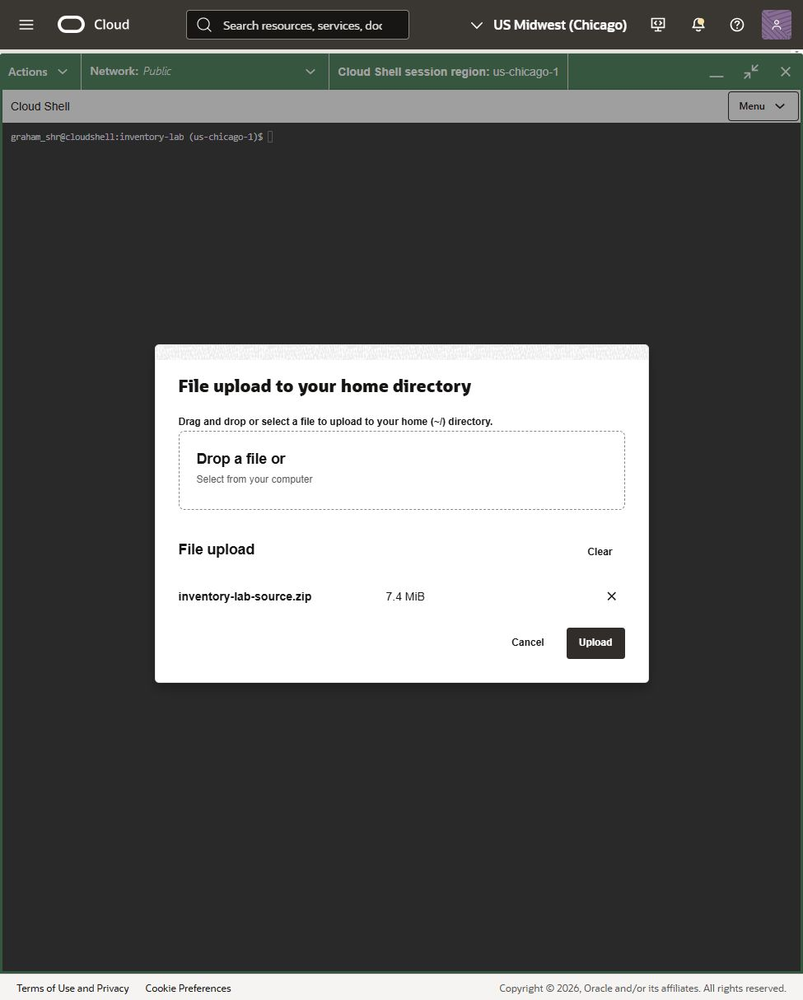

3. Confirm Python 3.12 is available, then extract the bundle into a new directory and open it:

```bash
python3.12 --version
mkdir inventory-lab && unzip inventory-lab-source.zip -d inventory-lab && cd inventory-lab
```

The first command should print `Python 3.12.x`. Use `python3.12` explicitly: the default `python3` can be a different version. If the command is unavailable, ask your facilitator to check the Cloud Shell environment. If `inventory-lab` already exists from an earlier attempt, use a new directory name throughout this task instead of overwriting it.

> **No dependency installation is needed:** The supplied checker, reference processing module, and repackaging script use only Python's standard library. Do not run `pip install` or install `requirements.txt` for this task. The function's OCI libraries are already inside the supplied deployment ZIP; Cloud Shell does not need to install or load them.

4. Read the [AI prompt](files/ai-prompt.txt). If using an AI assistant, submit the prompt and save its Python output as `function/inventory.py`, replacing the reference module. If you prefer the reference path, keep the supplied file and review its rules.

The function `process_inventory(csv_text, threshold=10)` returns two CSV strings. It trims values, uppercases product and warehouse codes, checks quantities, and selects valid rows with `quantity < threshold`.

> **Note:** Generate only the inventory-processing module. The supplied `func.py` handles OCI event parsing, Object Storage reads and writes, and logs. No AI service is called when the deployed function runs.

5. Run the checker from the `inventory-lab` directory:

```bash
python3.12 verify_inventory.py
```

6. Confirm that the output says **Ran 6 tests** and ends with **OK**. The tests cover all four sample files, normalization, threshold boundaries, and invalid input. If a generated implementation fails, read the failed assertion, correct the module, and run the checker again. Keep generated code limited to the standard library as the prompt requests; use the supplied reference version if you get stuck.

7. Open `inventory-run1.csv` and find the first five quantities: **2, 4, 5, 7, 9**. These are the five products expected in the initial restock report. A quantity of exactly **10** does not qualify.

8. If you changed `function/inventory.py`, repackage your code with the supplied dependencies:

```bash
python3.12 package_logic.py
```

This creates **inventory-reporter-custom.zip**, keeping the tested Linux dependencies from the reference archive. You can also run this command with the unchanged reference module to practice packaging.

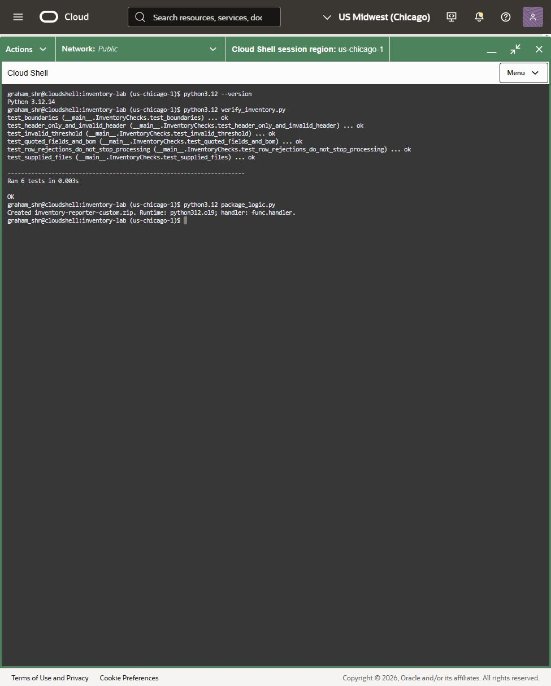

9. To download your custom archive, select **Menu > Download** in the Cloud Shell panel. Enter the path below, relative to your **home directory**, and select **Download**. Do not add a leading `/` or `~/` in the dialog; it already supplies `~/`.

```text
inventory-lab/inventory-reporter-custom.zip
```

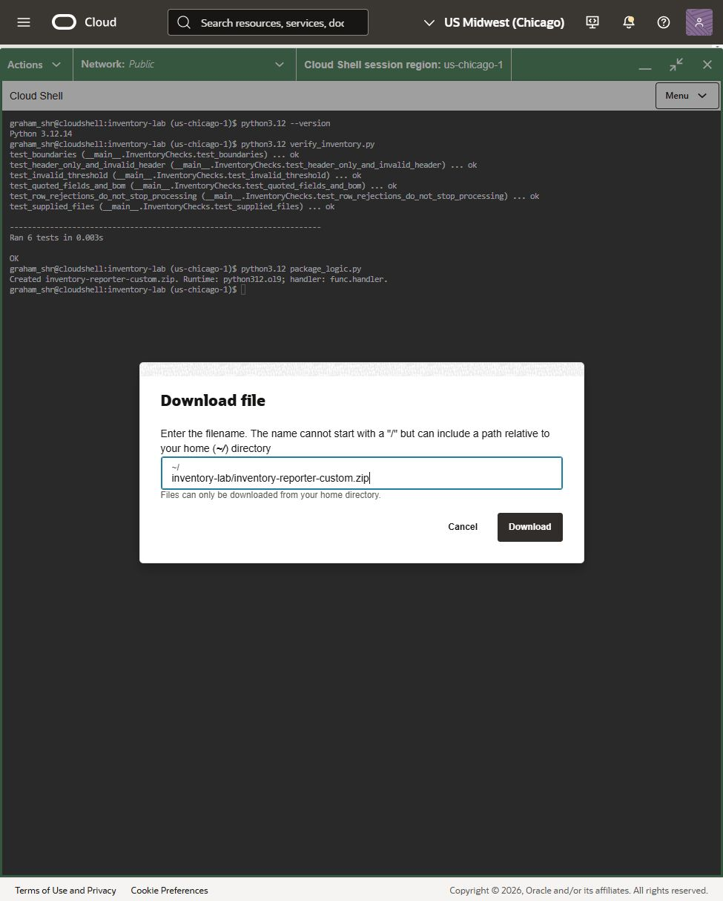

If using the unchanged reference implementation, you can instead use **inventory-reporter.zip** from the bundle extracted on your computer. Either way, you need the function ZIP on your computer for Task 3, not the outer `inventory-lab-source.zip`.

> **Checkpoint:** All checks pass. You can explain why the default rule selects five rows from the 20-row sample.

## Task 3: Create the function in your application

**Time:** 10 minutes. **Outcome:** The `inventory-reporter` function is active in `livelab-inventory-app`.

1. Open **Functions**, select **LiveLab**, and open **livelab-inventory-app**.

2. Select the **Functions** tab, open **Actions**, and select **Create from archive**.

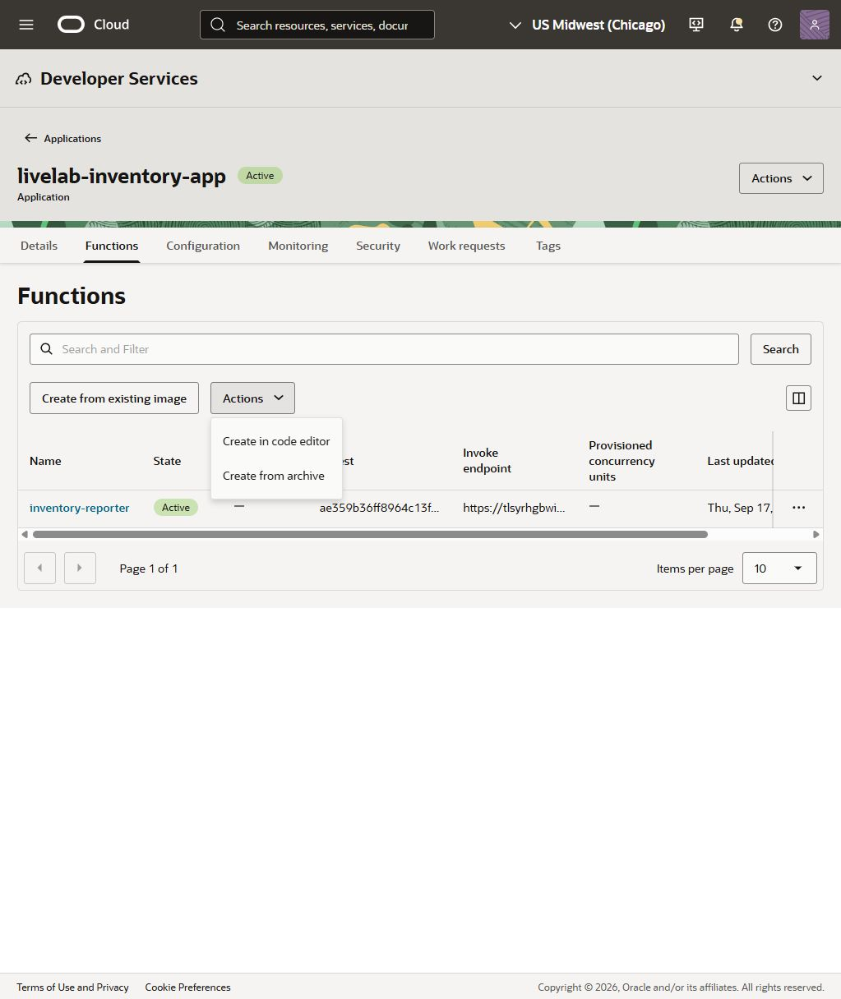

The reference image already contains a tested function. In a fresh lab, you create your own function here.

3. Enter **inventory-reporter** as the name. Under **File source**, select **Upload from your device**.

4. Select the reference **inventory-reporter.zip**, or the **inventory-reporter-custom.zip** you generated and checked in Task 2. Upload the function archive itself, not the outer source bundle.

5. Enter the settings below. The handler value means: load `func.py` from the archive's `function/` directory and call its `handler` function. The reference archive includes the OCI SDK and its Linux dependencies; the managed runtime supplies FDK. Do not rely on `requirements.txt` being installed during deployment.

The function will use these settings:

| Setting | Lab value |
| --- | --- |
| Compartment | `LiveLab` |
| Application | `livelab-inventory-app` |
| Function name | `inventory-reporter` |
| Runtime | `python312.ol9` |
| Handler | `func.handler` |
| Memory | 256 MB |
| Synchronous invocation timeout | 60 seconds |
| Runtime version management | Function update |
| Input bucket | `livelab-inventory-incoming` |
| Output bucket | `livelab-inventory-output` |
| Low-stock threshold | `10` |

The application supplies `INPUT_BUCKET`, `OUTPUT_BUCKET`, `OBJECT_STORAGE_NAMESPACE`, and `LOW_STOCK_THRESHOLD` as configuration. The function uses its OCI resource identity to access the buckets; there are no personal credentials in the code.

6. Leave provisioned concurrency disabled and the destination settings at their defaults. Select **Create** and wait until the function is **Active**.

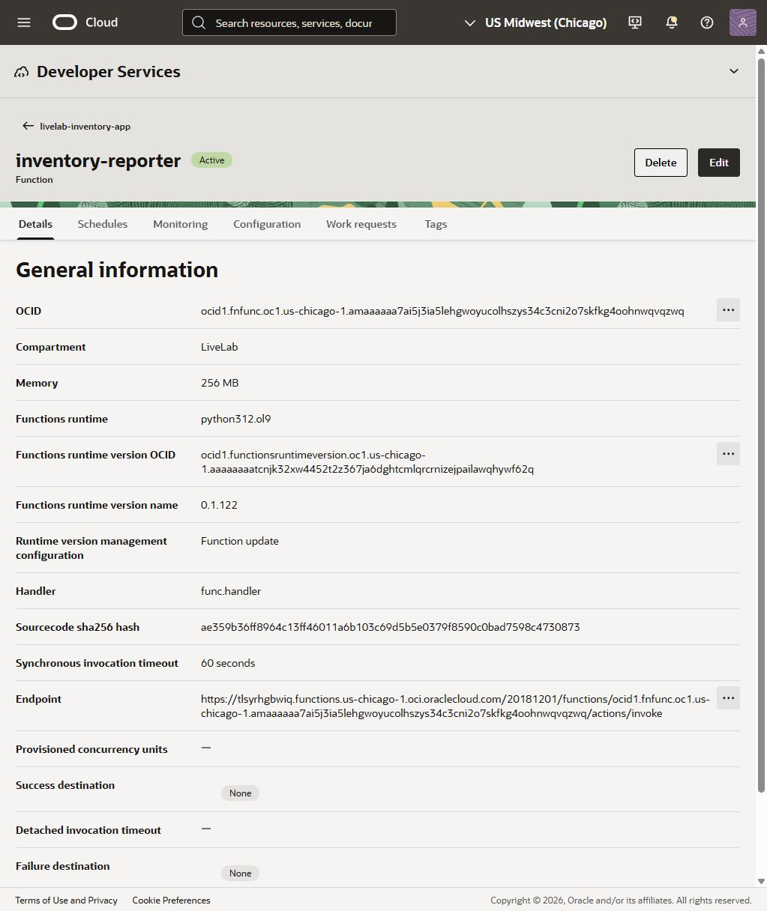

**Function update** means that OCI adopts a newer managed runtime version when the function is modified. The Python source and dependencies are in your archive; OCI manages the execution runtime.

> **Checkpoint:** Do not continue until the deployed function is **Active** and the application configuration matches the lab environment.

## Task 4: Connect the upload event

**Time:** 7 minutes. **Outcome:** An Events rule targets your function when a new object is created in the incoming bucket.

1. Search for **Events** in the Console and open the Events rules page. Select the **LiveLab** compartment.

2. Select **Create rule**, name the rule **livelab-inventory-upload**, and use a description such as `Process new supplier inventory CSV files`.

3. Configure the event condition:

| Field | Value |
| --- | --- |
| Condition | Event Type |
| Service | Object Storage |
| Event type | Object - Create |

4. Add an attribute condition for **bucketName**, with the value **livelab-inventory-incoming**. This restricts the rule to the lab's input bucket.

5. Add a **Functions** action and select the **LiveLab** compartment, **livelab-inventory-app** application, and **inventory-reporter** function.

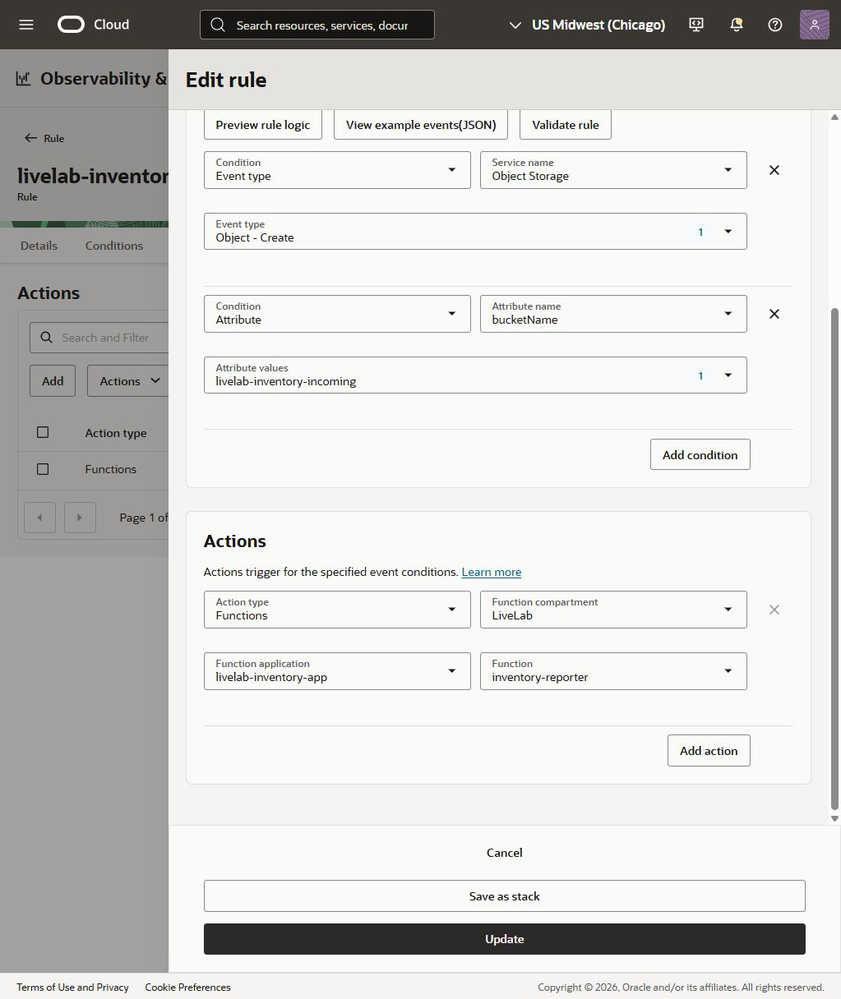

This reference image reviews an existing rule in **Edit rule**. When creating your rule for the first time, complete these fields in **Create rule**.

6. Create the rule and confirm that it is enabled. Inspect the condition and target once more before uploading a file.

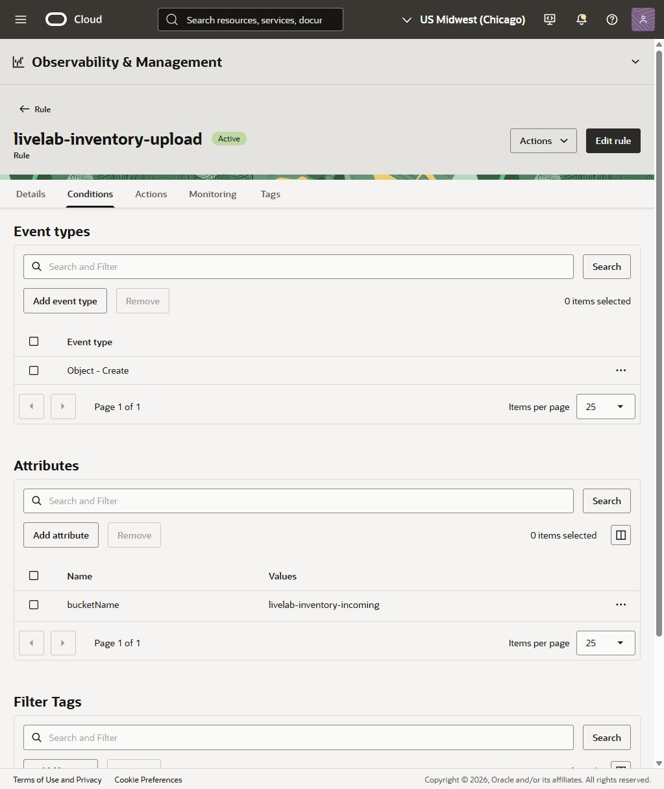

> **Note:** The function must exist before it can be selected as a rule action. Use a new object name for each exercise; replacing an existing object is an update, while this lab listens for object creation.

> **Checkpoint:** The enabled rule matches **Object - Create** for the incoming bucket and names your function as its action.

## Task 5: Upload inventory and inspect the reports

**Time:** 7-10 minutes. **Outcome:** You see five restock rows and an empty rejected-records report.

1. Download [inventory-run1.csv](files/inventory-run1.csv) to your computer. If your browser displays the CSV, save it as a file with that name.

2. In Object Storage, open **livelab-inventory-incoming** and select **Upload objects**.

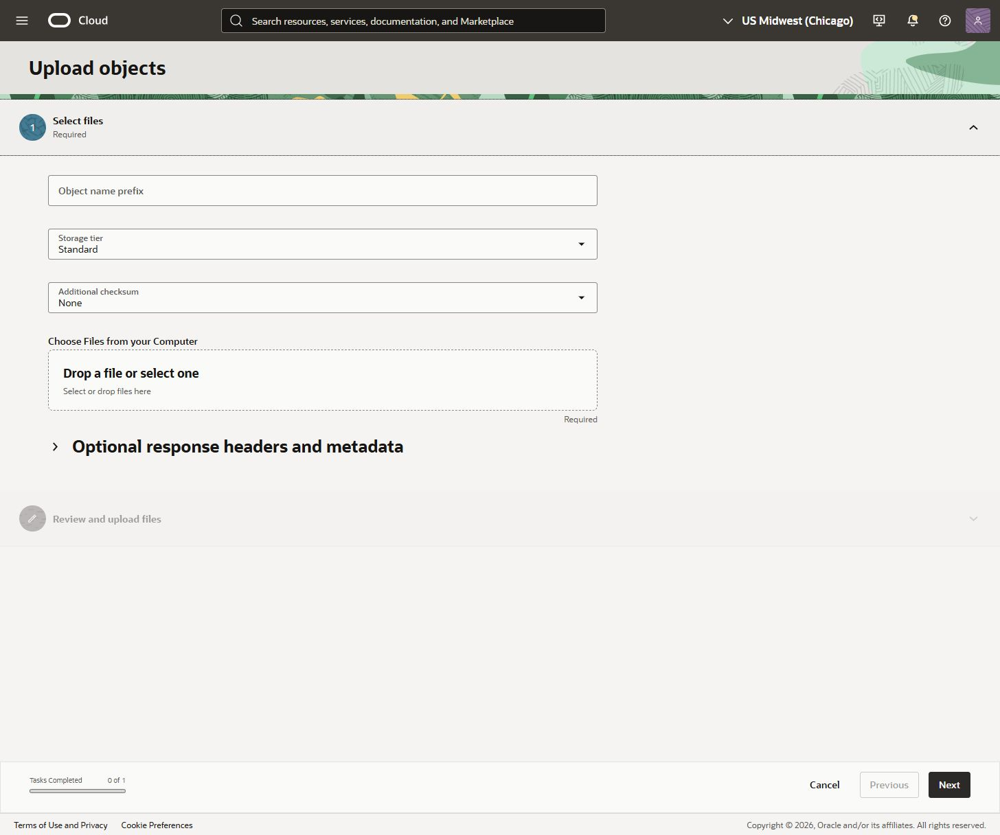

3. Leave **Object name prefix** blank and choose `inventory-run1.csv`. Keep **Standard** storage tier, select **Next**, review the file, and complete the upload.

4. Open **livelab-inventory-output**, then its **Objects** tab. Refresh the list until you see the `inventory-run1/` prefix. Event delivery and execution are asynchronous; the reports may not appear immediately.

5. Open that prefix and download **restock-report.csv** and **rejected-records.csv**.

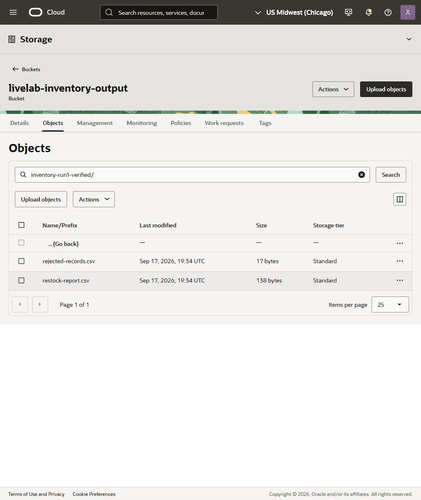

Your first upload uses `inventory-run1.csv` and produces `inventory-run1/`. A different new filename changes only the output prefix.

6. Compare the reports with the expected result:

| Report | Expected data rows | What to look for |
| --- | --- | --- |
| `restock-report.csv` | 5 | INV-001 through INV-005; normalized SKU and warehouse codes |
| `rejected-records.csv` | 0 | Only the `record_id,reason` header |

7. Check that the product with a quantity of **10** is absent from the restock report. The condition is **less than 10**, not less than or equal to 10.

> **Checkpoint:** Uploading a CSV produced two reports without a manual function invocation. You created an event-driven workflow: upload, match event, run code, write results.

If reports have not appeared after a few minutes, verify the region, input bucket, new filename, enabled rule, and function target. Then inspect the application's invocation logs. A `reports_written` message includes the source filename and report counts. Ask the facilitator for help if there is no invocation or a permissions error.

## Task 6: Optional extension - change the restocking threshold

**Time:** 5 minutes. Complete this after the core lab.

Operations wants earlier warning. Raise the threshold from 10 to 20.

1. Open **inventory-reporter**, select **Configuration**, then **Manage configuration**. Select **Add configuration** if there is no function-level row yet. Set the key to **LOW_STOCK_THRESHOLD** and its value to **20**. A function-level setting overrides the application value.

2. Select **Save changes** and wait until the function update is complete. This extension changes configuration; it does not require editing the processing module.

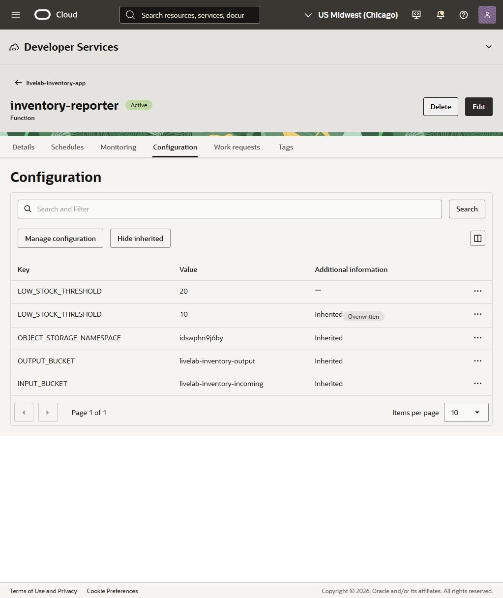

3. Upload [inventory-run2.csv](files/inventory-run2.csv) to the incoming bucket. It contains the same rows as the first file, under a new filename.

4. Download the reports under **inventory-run2/**. Expect **11** restock rows and **0** rejected rows. INV-007, with quantity 12, now appears in the restock report. A quantity of exactly 20 is still excluded.

> **Checkpoint:** A configuration change altered the business rule while keeping the Python code unchanged.

## Task 7: Optional extension - diagnose a bad row

**Time:** 5-10 minutes. Use a threshold of **20** for the counts below.

1. Upload [inventory-bad.csv](files/inventory-bad.csv). Only INV-007 differs from the good file: its quantity is the word `twelve`.

2. Download the reports under **inventory-bad/**. Expect **10** restock rows and **1** rejected row.

3. Open **rejected-records.csv** and confirm this entry:

```csv
record_id,reason
INV-007,invalid_quantity
```

4. Search for **Logs** in the Console and select **Logs** under **Logging**. Choose log group **livelab-functions-logs**, open **inventory-invocations**, and select **Explore log**. Beside **Time range**, open the actions menu, select **Edit**, choose **Past hour**, and select **Update**. The default five-minute window can miss an earlier run.

Enter `record_rejected` in **Search and Filter**, then select **Search**. Find the message containing `inventory-bad.csv`, `INV-007`, and `invalid_quantity`. Allow time for log ingestion. Expand the row or scroll horizontally to read the full message. For the compact view shown below, use **Manage Columns** to display only **data.message**.

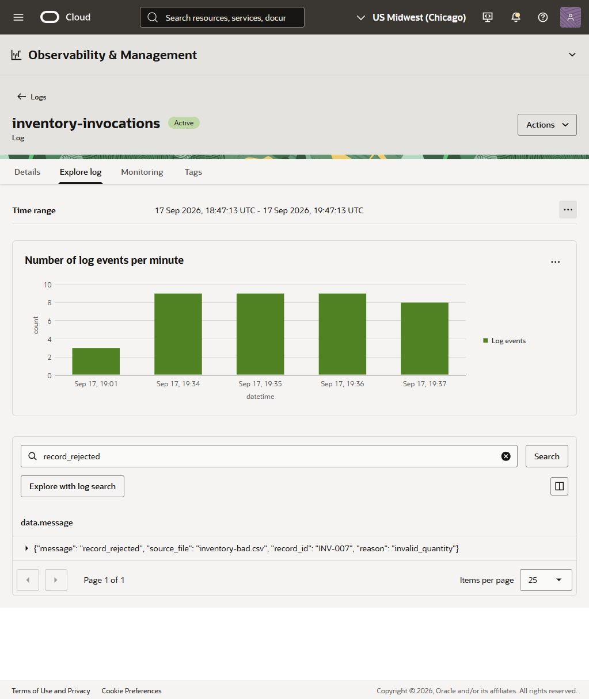

5. Correct the quantity to **12** and save the CSV as **inventory-fixed.csv**, or use the [supplied corrected file](files/inventory-fixed.csv). Upload it to the incoming bucket.

6. Inspect **inventory-fixed/**. Expect **11** restock rows and a header-only rejected-records report.

7. Restore the function's **LOW_STOCK_THRESHOLD** value to **10** and save the change after finishing both extensions.

> **Checkpoint:** One bad row did not prevent valid rows from producing a useful report. The rejected record had an explicit reason and could be traced back to its input file.

## Task 8: Recap and finish

You used an OCI Functions application to host Python business logic, connected an Object Storage event to the function, and verified a useful result. The same pattern can validate incoming files, normalize records, or automate other short processing tasks.

1. Explain the workflow to a partner: what caused the function to run, where it read data, and where it wrote the result.

2. If you changed the threshold, restore it to **10**. Follow your facilitator's environment cleanup guidance. Only clean up resources assigned to your lab; do not delete shared or unrelated resources.
